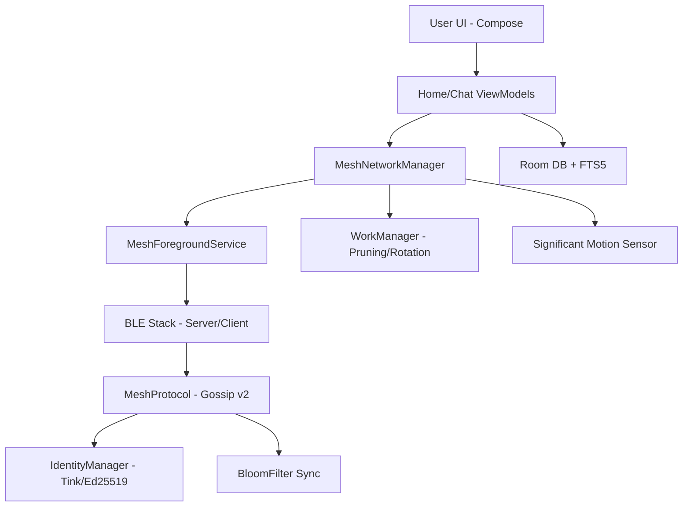
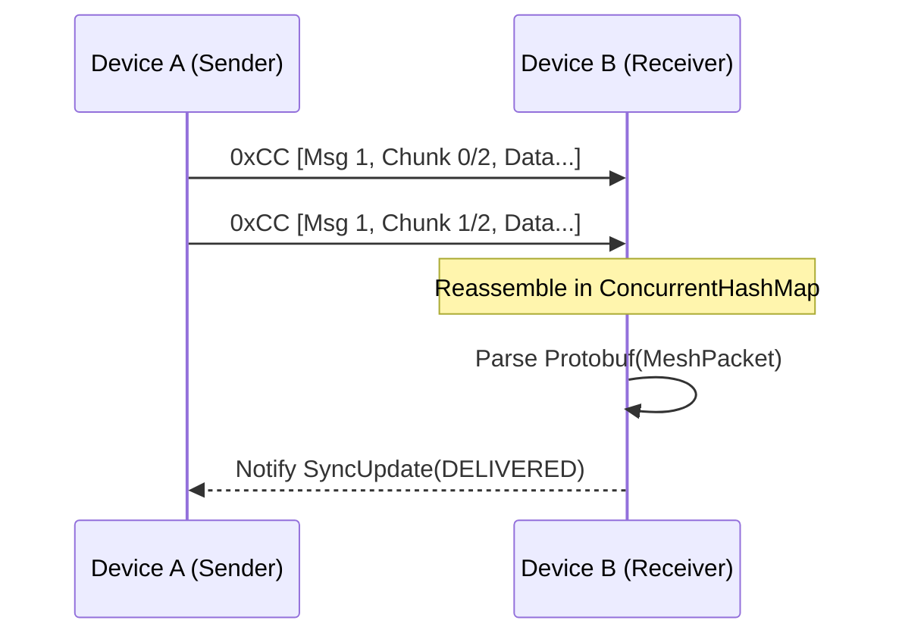

# Mesh Talk: Technical Architecture Deep Dive

Mesh Talk (v1.2.0) is built on a custom P2P stack optimized for the constraints of Bluetooth Low Energy.

## 0. High-Level System Diagram

---

## 1. Networking Stack: The BLE Mesh Engine

Mesh Talk operates on a hybrid GATT (Generic Attribute Profile) model where every device acts as both a **GATT Server** and a **GATT Client** simultaneously.

### A. Discovery Layer (Scanning & Advertising)
- **Advertising**: The device broadcasts a 128-bit Service UUID (`MeshConstants.SERVICE_UUID`).
- **Hardware Filtering**: Implements `ScanFilter` at the OS level to ensure the hardware BLE chip only wakes the app for Mesh Talk packets.
- **Scanning**: Performs batched scans (`setReportDelay`) to reduce CPU wake-up frequency.
- **Adaptive Duty Cycle**: 
    - **Active Mode**: When the **Significant Motion Sensor** detects motion, scanning occurs every 30 seconds with balanced power.
    - **Idle Mode**: When stationary, the interval backs off to 5 minutes with `LOW_POWER` advertising, keeping the CPU in deep sleep.

### B. Transport Layer (Fragmentation & Reassembly)

BLE has a limited MTU (Maximum Transmission Unit).
 Mesh Talk uses a custom fragmentation protocol to send large data (Images/Protobuf):
1.  **GATT MTU**: Negotiated at connection time (requested 512 bytes, typically 185-247 bytes on modern Android).
2.  **Binary Chunks**: Data is split into `MTU - 4` byte segments.
3.  **The 0xCC Header**: Every chunk is prefixed with a 4-byte tracking header:
    - `Byte 0`: `0xCC` (Protocol Magic Byte)
    - `Byte 1`: `MessageID` (8-bit wrapping counter)
    - `Byte 2`: `ChunkIndex`
    - `Byte 3`: `TotalChunks`
4.  **Reassembly**: The `MeshGattServer` and `MeshGattClient` maintain an in-memory `ConcurrentHashMap` of `ReassemblyBuffers`. If all chunks aren't received within a timeout window, the buffer is purged to prevent memory leaks.

---

## 2. Scalability Protocol: Gossip v2

To prevent "Broadcast Storms" in high-density environments (e.g., 1000+ users in range), Mesh Talk implements **Counter-based Suppression**.

### Suppression Algorithm:
1.  **Message Arrival**: Device receives a message with `hopCount < MAX_HOPS`.
2.  **Randomized Wait**: Instead of immediate forwarding, the device waits for a random period $T$ (where $20ms \leq T \leq 150ms$).
3.  **Listen & Count**: During $T$, the device monitors the mesh for the same `MessageUUID`.
4.  **Forwarding Decision**:
    - If the device hears the same message from $\geq 3$ neighbors, it **suppresses** its own broadcast (concluding the area is already saturated).
    - If $< 3$ neighbors are heard, it broadcasts the message.
5.  **State Tracking**: `heardCounts` are tracked in a thread-safe `ConcurrentHashMap` and pruned every 100 entries.

---

## 3. Security & Privacy Architecture

Mesh Talk follows a **Zero-Trust** decentralized identity model.

### A. Cryptographic Stack (Google Tink)
- **Identity Key**: Ed25519 (Used for signing and peer identification).
- **Encryption Key**: ECIES with P-256 HKDF-HMAC-SHA256 and AES128-GCM.
- **Handshake**: Peers exchange public keys and Bloom filters in a single Protobuf transaction.

### B. Stealth Identities (Anti-Stalking)
To prevent physical tracking of the hardware MAC address or a fixed Public Key hash:
1.  The BLE `Service Data ID` is rotated every 15 minutes.
2.  **Rotation Math**: $StealthID = SHA256(PublicKey + (Timestamp / 15min\_window)).take(4)$
3.  **Recognition**: Verified peers (who have stored the contact's Public Key) can pre-calculate the expected Stealth ID for the current time window to recognize their friends silently.

---

## 4. Data Sync: Bloom Filter Exchange

Instead of exchanging full "Inventory Lists" (which grow linearly with message count), Mesh Talk uses **Probabilistic Data Structures**.

1.  **Handshake**: Device A sends a 512-bit (64-byte) **Bloom Filter** representing its last 500 received message UUIDs.
2.  **Comparison**: Device B checks its own pending messages against A's filter.
3.  **Selection**: Device B only pushes messages that are **not present** in A's filter.
4.  **Efficiency**: This reduces the sync metadata overhead by $>90\%$ while maintaining a near-zero false-negative rate.

---

## 5. Persistence & Performance

### A. Foreground Persistence
The `MeshForegroundService` is the heartbeat of the app:
- **Foreground Type**: `connectedDevice`.
- **Connectivity Recovery**: Uses a `BluetoothStateReceiver` to detect system-level Bluetooth toggles and trigger a mesh warm-start.
- **Sticky Start**: Uses `START_STICKY` to ensure Android restarts the mesh engine if the system kills it under memory pressure.

### B. Database Optimization (Room + FTS5)
- **FTS5 Virtual Table**: The `MessageFts` entity mirrors the `Message` table, providing full-text search indexing on message content.
- **Query Logic**: Searches use a `JOIN` between the standard table and the FTS5 index on the `uuid` column.
- **Indices**: Non-text columns (`timestamp`, `senderId`, `receiverId`, `groupId`) are indexed with B-Trees for sub-millisecond sorting of the chat feed.

## 6. Decentralized Anti-Spam: Proof-of-Work

To prevent Sybil attacks and flooding in 1B+ user environments, Mesh Talk implements a CPU-bound **Proof-of-Work (PoW)** requirement for all broadcasts.

### The PoW Algorithm
1.  **Nonce Finding**: Before sending, the device iterates through a 64-bit integer (`powNonce`).
2.  **Hashing**: Calculates $SHA256(UUID + SenderID + Content + Timestamp + Nonce)$.
3.  **Difficulty**: The resulting hash must have a specific number of leading zero bits (default: 6 bits for reliability).
4.  **Verification**: Receiving nodes instantly verify the hash. If the PoW is invalid, the packet is dropped and never forwarded or stored.

---

## 7. User Experience & Lifecycle management

### A. Real-Time Online Status
- **GATT Tracking**: `MeshNetworkManager` maintains a list of currently active GATT connections.
- **UI Reactivity**: The Chat header subtitle updates in real-time to "Online" when a direct link is established.
- **Last Seen**: When a peer disconnects, the UI displays a human-readable duration since the last BLE advertisement was received from that Stealth ID.

### B. Smart Notifications
- **Foreground Awareness**: The `MeshApplication` tracks the `currentChatPeerId`.
- **Logic**: Notifications are suppressed if the app is in the foreground AND the user is already viewing the specific sender's chat window, preventing redundant alerts.
- **Image Previews**: Protobuf-level type detection allows notifications to show "Sent an image" instead of raw data blobs.
